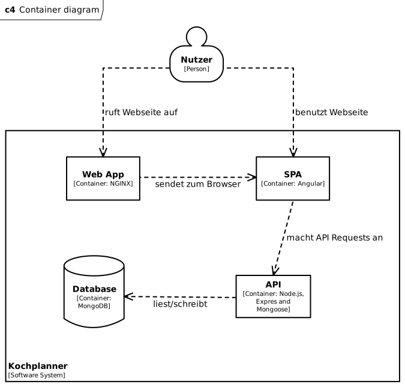

# Architekturbeschreibung Kochplanner

## Kontext

Keine externen Systeme.

## Lösungsstrategie

Der Technologiestack des System besteht aus Angular, Node, Express und MongoDB. Dies bietet sich als typische Kombination von Technologien an. Im Sinne des Moduls WEBLAB habe ich dies gewählt, um ein Mix aus mir mehr oder weniger bekannten Technologien zu haben (Etwas Erfahrung mit Node, etwas weniger mit Express und MongoDB und fast keine mit Angular)

Für das Frontend und Backend wird Typescript verwendet.

Die Webseite ist eine SPA und das Backend dient lediglich als API.

Für die Authentifizierung werden JWT verwendet.

## Bausteinsicht

## Ebene 1

| Container | Beschreibung                                                         |
|-----------|----------------------------------------------------------------------|
| Web App   | NGINX Server, um die Angular App bereitzustellen                     |
| SPA       | Angular Frontend                                                     |
| API       | Node.js und Express Backend. Liest/schreibt Datenbank über Mongoose. |
| Database  | MongoDB Datenbank                                                    |

## Ebene 2

### API (Ebene 2)

### SPA (Ebene 2) 

Component und Service beziehen sich auf die Angular Terminologie.

| Component              | zeigt                                                            | verwendet           |
|------------------------|------------------------------------------------------------------|---------------------|
| App Component          | Header Component, Router Outlet                                  |                     |
| Router Outlet          | Overview, Meal-Form, Meal-Detail, Login, Registration Components |                     |
| Header Component       | Logout, User Components                                          | Auth Service        |
| Logout Component       |                                                                  | Auth Service        |
| User Component         |                                                                  | User Service        |
| Overview Component     |                                                                  | Meal Service        |
| Meal-Form Component    |                                                                  | Meal, User Services |
| Meal-Detail Component  |                                                                  | Meal, Auth Services |
| Login Component        |                                                                  | Auth Service        |
| Registration Component |                                                                  | Auth Service        |
| User Component         |                                                                  | User Service        |

## Verteilungssicht

Frontend und Backend enthalten jeweils ein Dockerfile, mit welchen ein Docker Container der beiden Applikationsteile generiert werden kann. Im Root befindet sich zusätzlich ein Docker Compose File (`production.stack.yaml`) mit dem der ganze Stack auf einer Maschine deployed werden kann.

Anstatt diesen Docker Containern kann auch direkt Node.js für das Backend und jeglicher staticher Webserver für das Frontend verwendet werden.

## Querschnittliche Konzepte

### Session Handling

Es werden keine Sessions verwendet.

### Authentifizierung

Die meisten API Endpoints erlauben nur Zugriff mit gültigem JWT. Ausgenommen sind die Endpoints für Login und Registrierung.

### Verifizierung

Neu registrierte Nutzer werden als nicht verifiziert abgespeichert. Accounts können nur verwendet werden, sobald diese verifiziert wurden.

### Validierung

POST und PUT requests an die API werden mittels mongoose Datenmodellen validiert.

Filter-Optionen bei GET requests werden auf Gültigkeit überprüft, so dass keine unerwarteten Datenbank-Anfragen gemacht werden.

### Error Handling

Fehlerhaften Zugriffen auf die API wird mit passenden HTTP errors geantwortet. 

### Builds

Builds für Frontend und Backend können für Node Projekte typisch über die angebotenen build scripts erstellt werden (Angular CLI für Frontend). Den beiden Applikationsteilen liegt zusätzlich ein Dockerfile bei, um Docker Container zu erstellen.

### Konfiguration

Das Backend wird mittels Environment Variablen konfiguriert (DB Credentials, JWT Optionen, CORS Origin).

## Architekturentscheidungen

Ursprünglich war geplant für die Authentifizierung Auth0 zu verwenden. Durch fehlende Erfahrung entstand grosser Aufwand und es folgte die Entscheidung den Login im eigenen System zu implementieren.

## Qualitätsziele

Das Projekt dient mir dazu die verwendeten Technologien besser kennenzulernen.